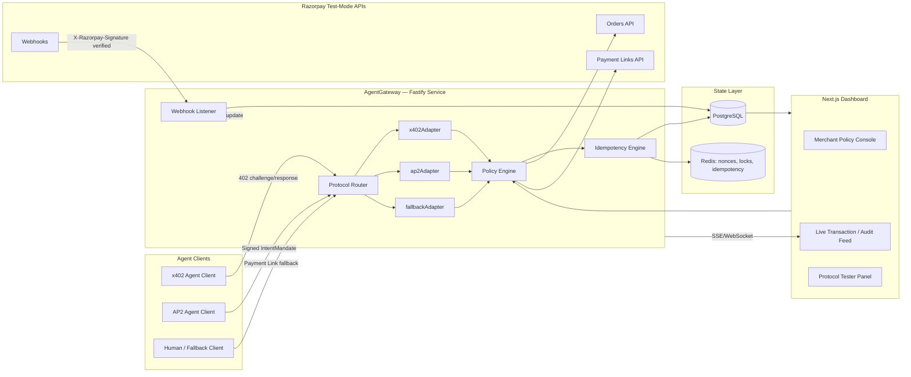

# AgentGateway

**A universal protocol-translation gateway for agentic commerce.**
Built for the Razorpay AI Buildathon — Track 01: AI Growth & Agentic Commerce.

AgentGateway is middleware that sits in front of Razorpay's existing settlement rails.
It does not reinvent payments — it **normalizes intent**. An agent request arriving in
x402, AP2, or no protocol at all is validated against its own native rules, normalized
into a single internal shape, checked against merchant-defined guardrails, settled
through Razorpay's Orders / Payment Links APIs, and translated back into whatever
receipt shape the calling protocol expects.

> _"The protocol layer proposes, but Razorpay's webhook confirms."_

That one rule governs the whole system. An x402 payment proof, an AP2 mandate signature,
and an optimistic client response are all **claims** — enough to _authorize_ an attempt,
never enough to _confirm_ money moved. Only a signature-verified Razorpay webhook is
ground truth.

Full design rationale lives in **[WHITEPAPER.md](WHITEPAPER.md)**. The build sequence
lives in **[ROADMAP.md](ROADMAP.md)**.

---

## Architecture

Reproduced from [WHITEPAPER.md](WHITEPAPER.md) §2.1.



**Data flow in one sentence:** an agent's request enters through a protocol-specific
adapter, gets normalized, is checked against policy, triggers a real Razorpay
Order/Payment Link, and is only marked "settled" once a verified webhook confirms it —
at which point a protocol-shaped receipt goes back to the agent and the dashboard
updates in real time.

---

## Repository layout

```
.
├── WHITEPAPER.md              # design source of record
├── ROADMAP.md                 # phased execution plan (§4 of the whitepaper)
├── tasks.todo                 # working checklist
├── docker-compose.yml         # postgres:16 + redis:7 + gateway
└── packages/
    ├── gateway/               # Fastify service — router, adapters, policy, Razorpay
    ├── dashboard/             # Next.js merchant console (Phase 5)
    └── agent-client/          # reference buyer agent (Phase 4)
```

---

## Setup

### Prerequisites

- Node.js ≥ 20.11
- Docker Desktop (or any Docker engine with Compose v2)
- Razorpay **test-mode** API keys — dashboard → Test Mode → Settings → API Keys

### 1. Configure environment

```bash
cp .env.example .env
```

Fill in `RAZORPAY_KEY_ID`, `RAZORPAY_KEY_SECRET` and `RAZORPAY_WEBHOOK_SECRET`.
`.env` is gitignored; `.env.example` is the committed template.

### 2. Install dependencies

```bash
npm install
```

### 3. Bring up Postgres, Redis and the gateway container

```bash
docker compose up -d --build
```

> **⚠️ Always pass `--build` when the gateway's source has changed.**
>
> `docker compose up -d --force-recreate` recreates the container from the **existing
> image** — it does _not_ rebuild it. The gateway's Dockerfile copies `packages/gateway`
> in at build time, so without `--build` the container silently keeps serving whatever
> code was current when the image was last built, no matter how many times you recreate
> it.
>
> This bit us during Phase 3 webhook verification: an image built before Phase 2 was
> still answering `POST /webhooks/razorpay` with the Phase 1 `501 not_implemented` stub,
> hours after that code had been replaced. `/health` returned 200 the whole time, because
> `/health` had not changed. Nothing looks wrong until a specific route misbehaves.
>
> Rule of thumb: `--build` after any source change, `--force-recreate` only when you
> merely need fresh environment variables (Compose reads `.env` at container-create
> time, so a changed `.env` does require a recreate).

Three services come up: `postgres` on 5432, `redis` on 6379, and a containerised
`gateway` on **3001**. All three have healthchecks, and the gateway waits for
`service_healthy` on both dependencies before it starts.

### 4. Apply the database schema

```bash
npm run db:migrate --workspace=gateway
```

Run it through the workspace rather than a bare `npx prisma` — Prisma 7 reads its
connection URL from `packages/gateway/prisma.config.ts`, not from `schema.prisma`.

This creates the eight tables from §2.3.

> **⚠️ Migration safety — hand-written constraints**
>
> Two parts of the §2.3 contract are **not** expressed in `schema.prisma`, because
> Prisma cannot express them and its generator will not emit them:
>
> 1. **The six `CHECK` constraints** — `agent_identities.protocol`,
>    `agent_identities.trust_level`, `payment_requests.normalized_amount_paise`,
>    `payment_requests.status`, `razorpay_orders.status`, `audit_log.actor_type`.
>    Prisma has no `CHECK` support at all.
> 2. **`merchants.enabled_protocols NOT NULL`** — Prisma does not emit `NOT NULL` for
>    scalar list columns, so a regenerated migration silently drops it.
>
> Both live in a clearly-marked block at the **bottom** of
> `packages/gateway/prisma/migrations/20260829171150_init/migration.sql`. That block is
> committed to version control specifically so a diff would show if it went missing.
>
> **If you regenerate a migration from `schema.prisma`, you must re-add that block by
> hand.** Otherwise the database will accept rows the whitepaper forbids — an invalid
> protocol name, a zero-amount payment request, a NULL protocol list. The test suite
> exercises those columns but not the constraints; `psql` is the only thing that will
> tell you they are gone:
>
> ```bash
> docker compose exec postgres psql -U agentgateway -d agentgateway \
>   -c "SELECT conname FROM pg_constraint WHERE contype='c' ORDER BY 1;"   # expect 6 rows
> ```

### 5. Run the gateway on the host

```bash
npm run dev --workspace=gateway
```

Binds `PORT` from `.env` (default **3000**), so it can run alongside the containerised
gateway on 3001 without a port clash.

```bash
curl -s http://localhost:3000/health | jq
```

`/health` returns **200 only when both Postgres and Redis answer**; a degraded
dependency yields 503 with a per-dependency breakdown.

### 6. Confirm the Razorpay SDK round-trips

```bash
npm run razorpay:smoke --workspace=gateway
```

Creates one ₹1.00 test Order and prints it. Confirm it appears under
Test Mode → Transactions → Orders in the Razorpay dashboard.

### Optional: the dashboard

```bash
npm run dev --workspace=dashboard    # http://localhost:3002
```

---

## Authentication & rate limiting (Phase 4.5)

Every `/v1/merchant/*` route requires a merchant API key as a bearer token —
**including `POST /v1/merchant/agents/register`**, which is not a special case:

```bash
curl -H "Authorization: Bearer agk_..." http://localhost:3000/v1/merchant/policy
```

Mint a key with the operator script. Merchant creation deliberately lives here rather
than behind an HTTP route — you cannot bootstrap a merchant using a key that merchant
does not yet have:

```bash
npm run merchant:create --workspace=gateway -- --name "My Merchant"   # creates + mints
npm run merchant:create --workspace=gateway -- --list                 # keys + secret status
npm run merchant:create --workspace=gateway -- --key-for <merchantId> # rotate/add a key
```

The key is printed **once** and only its SHA-256 hash is stored, so it cannot be
recovered — mint a new one instead. The merchant a request acts on is derived from the
key server-side; `merchantId` is never read from the request body.

### Rate limits

Keyed by **who is calling**, not by IP — agents and dashboards sit behind NAT, so an
IP-keyed limit would either punish co-located callers or be trivially evaded.

| Scope                 | Keyed on                  | Env var                                                     | Default          |
| --------------------- | ------------------------- | ----------------------------------------------------------- | ---------------- |
| `/v1/merchant/*`      | merchant API key (hashed) | `RATE_LIMIT_MERCHANT_MAX` / `RATE_LIMIT_MERCHANT_WINDOW_MS` | 120 per 60000 ms |
| payment-facing routes | agent identity, else IP   | `RATE_LIMIT_AGENT_MAX` / `RATE_LIMIT_AGENT_WINDOW_MS`       | 60 per 60000 ms  |
| `/webhooks/*`         | —                         | —                                                           | **exempt**       |

`/webhooks/*` is exempt on purpose: dropping a settlement confirmation because Razorpay
burst is far worse than the burst itself (§1.3). Exceeding a limit returns `429` with
`retry-after` and `x-ratelimit-*` headers.

### Secrets at rest

`merchants.razorpay_key_secret_encrypted` is encrypted with AES-256-GCM under
`MERCHANT_SECRET_ENCRYPTION_KEY` (base64 of 32 random bytes). Generate one with:

```bash
node -e "console.log(require('crypto').randomBytes(32).toString('base64'))"
```

Rotating that key makes every previously-stored merchant secret undecryptable.

---

## CORS and security headers (Phase 7)

### CORS policy

The gateway allows cross-origin browser requests **only from the origins listed in
`DASHBOARD_ORIGIN`** (comma-separated, defaults to `http://localhost:3002`, the
console's dev port). Every other
origin is refused, in every environment.

```bash
# .env — a deployed console on a different host
DASHBOARD_ORIGIN=https://console.example.com
```

Two details worth stating plainly, because both look like holes and neither is:

- **A request with no `Origin` header is allowed.** That is every non-browser client:
  curl, the reference agent, and Razorpay's webhook delivery. CORS is a browser
  mechanism and has nothing to say about them — their authorization is the merchant API
  key and the webhook HMAC, which are enforced regardless of origin. Rejecting
  origin-less requests would break every server-to-server caller and secure nothing.
- **`credentials: true` is set**, which is why the allowlist has to be explicit. The
  previous setting was `origin: true` in development, which reflects back whatever origin
  the caller sends; combined with credentials, any page a merchant happened to visit
  could have issued credentialed requests to a gateway on their machine and read the
  replies.

The SSE endpoint `GET /v1/merchant/stream` writes to the raw socket and therefore bypasses
`@fastify/cors`. It sets the same allowlisted origin header itself — if you change the CORS
policy, change it there too, or the console's live feed silently stops working in the
browser while continuing to work under curl.

### Security headers

`@fastify/helmet` is registered globally. The gateway serves JSON and never HTML, so the
headers that matter are the ones preventing a response from being reinterpreted as
something renderable:

| Header                         | Value                                           |
| ------------------------------ | ----------------------------------------------- |
| `Content-Security-Policy`      | `default-src 'none'; frame-ancestors 'none'; …` |
| `X-Content-Type-Options`       | `nosniff`                                       |
| `Referrer-Policy`              | `no-referrer`                                   |
| `Cross-Origin-Resource-Policy` | `same-site`                                     |
| `Strict-Transport-Security`    | helmet default (only acted on over HTTPS)       |

See [HARDENING.md](HARDENING.md) for what was tested, what was found, and what is
deliberately out of scope.

---

## Useful commands

| Command                                                     | What it does                                                        |
| ----------------------------------------------------------- | ------------------------------------------------------------------- |
| `npm run dev`                                               | Gateway in watch mode on `PORT`                                     |
| `npm run dev:dashboard`                                     | Next.js dashboard on 3002                                           |
| `npm test`                                                  | Vitest across workspaces                                            |
| `npm run typecheck`                                         | `tsc --noEmit` across workspaces                                    |
| `npm run lint`                                              | ESLint across the repo                                              |
| `npm run format`                                            | Prettier write                                                      |
| `npm run db:migrate`                                        | `prisma migrate dev`                                                |
| `npm run db:generate`                                       | Regenerate the Prisma client                                        |
| `npm run merchant:create --workspace=gateway -- --name "X"` | Create a merchant and mint its API key                              |
| `docker compose up -d --build`                              | Rebuild the gateway image and restart — use after ANY source change |
| `docker compose down -v`                                    | Tear down and drop the volumes                                      |

---

## Current status — all phases complete

Every phase in [ROADMAP.md](ROADMAP.md) is implemented and verified against Razorpay
test mode with live credentials.

| Phase | What it delivered                                                                 |
| ----- | --------------------------------------------------------------------------------- |
| 0–1   | Monorepo, Docker stack, Prisma schema transcribed 1:1 from §2.3, `/health`        |
| 2     | Row-locked spend cap (§3.5), webhook HMAC verification (§3.4), Razorpay client    |
| 3     | x402 / AP2 / fallback adapters, Ed25519 + JCS, two-layer replay protection (§3.2) |
| 4     | Reference AI agent — both protocols, one cart, provider-agnostic reasoning layer  |
| 4.5   | Merchant API keys, tenant isolation, secrets encrypted at rest, rate limiting     |
| 5     | Merchant console: guardrails, live audit feed, agent revocation, protocol tester  |
| 6     | Chaos scenarios, load profile, this README, demo script                           |

**Evidence, not assertions:**

- [docs/chaos-report.md](docs/chaos-report.md) — four chaos scenarios run live against a
  running gateway, with before/after state
- [docs/load-profile.md](docs/load-profile.md) — latency under rising concurrency, with
  an honest account of what the numbers do and don't mean
- [docs/screenshots/](docs/screenshots/) — the console in both themes
- [docs/demo-script.md](docs/demo-script.md) — the 5-minute walkthrough

## Roadmap

Phases 2 through 6 — database layer and policy engine, protocol adapters and the
cryptographic engine, the reference AI agent client, the merchant dashboard and
protocol tester, and end-to-end chaos testing — are specified in
**[ROADMAP.md](ROADMAP.md)**, with the working checklist in
**[tasks.todo](tasks.todo)**.

---

## Known limitations

Stated plainly rather than hidden. The first three are carried from
[WHITEPAPER.md](WHITEPAPER.md) §5.4; the rest were found while building and are recorded
because a limitation you discovered and wrote down is worth more than one you didn't.

**Protocol scope**

- **x402 is reinterpreted, not reimplemented.** Its reference implementation assumes
  on-chain stablecoin settlement. This build maps the HTTP-402 _shape_ onto Razorpay's
  INR rails: the envelope carries a Razorpay reference rather than a token contract, and
  "payment proof" is a signed reference to a `payment_id` rather than a transaction hash.
  A deliberate substitution, called out rather than glossed.
- **UAP is not implemented.** There is no public, stable, RBI-approved specification to
  build against yet. The `ProtocolAdapter` interface exists so it becomes one new class
  when there is — not a rewrite.
- **Test mode only.** mTLS between gateway and merchant systems, and multi-region webhook
  redundancy, are future work.

**Deliberate deferrals**

- **AP2 cannot be triggered live from the dashboard.** Signing an `IntentMandate` needs
  the agent's Ed25519 private key, and putting that in a browser would break the §3.1
  guarantee that the key never leaves the machine holding it. The protocol tester replays
  real recorded runs for AP2 and drives x402 live, which needs no client-side signature.
- **`capturePayment` is unit-tested only.** Razorpay auto-captures in this configuration,
  so no flow calls it. The wrapper exists so a future manual-capture flow has a typed
  entry point.
- **The agent-onboarding route is demo-grade.** `POST /v1/merchant/agents/register` is
  authenticated, but a production onboarding flow belongs behind a merchant portal, not
  an API key that can mint its own agents.

**Known behavioural gaps**

- **A failed settlement strands budget.** The spend cap is debited when the Policy Engine
  approves, _before_ `settle()` calls Razorpay. If that call fails, the request is marked
  `failed` but the debit stands. The cap is never _exceeded_, so this is not a safety
  bug — but budget can be stranded, and releasing the debit on a failed settle is real
  future work. Observed live under 20 simultaneous Razorpay calls.
- **The fallback path does not consume the spend cap at request time.** A Payment Link is
  a human-approval flow, so the Policy Engine returns before the cap is debited. Enforcing
  it at webhook-settlement time is the correct fix and is not done.
- **Razorpay's own rate limiting is indistinguishable from ours at the client.** Both
  surface as HTTP 429 through the same error handler. See
  [docs/load-profile.md](docs/load-profile.md).

**Operational**

- The demo relies on OpenRouter's free tier for the agent's reasoning layer, which has
  returned upstream 502s during verification. The deterministic picker is the designed
  fallback; see the hedge in [docs/demo-script.md](docs/demo-script.md).
