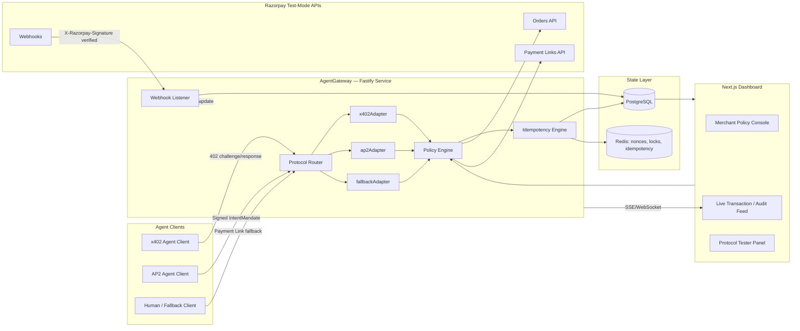

# AgentGateway
## A Universal Protocol-Translation Gateway for Agentic Commerce
### Technical Whitepaper & Full-Stack Implementation Roadmap

**Prepared for:** Razorpay AI Buildathon — Track 01: AI Growth & Agentic Commerce
**Status:** Design & Build Roadmap (Test-Mode Implementation)

---

## 1. Executive Summary & Protocol Landscape Analysis

### 1.1 The Problem: Protocol Fragmentation

Agentic commerce is being defined simultaneously, and independently, by at least four separate actors:

| Protocol | Owner | What it standardizes |
|---|---|---|
| **AP2** (Agent Payments Protocol) | Google | Signed, verifiable payment intent objects — `IntentMandate`, `PaymentMandate`, `PaymentReceipt` — establishing *authorization* and *auditability* for agent-initiated payments |
| **x402** | Coinbase, now governed by the x402 Foundation (Linux Foundation) | A machine-native payment handshake built on the dormant HTTP `402 Payment Required` status code — a stateless challenge/response for settling a resource request inline over HTTP |
| **ACP** (Agentic Commerce Protocol) | OpenAI | Catalog and checkout interoperability — how an agent discovers and transacts against a merchant's product surface |
| **UAP** (Unified Agent Protocol) | NPCI | India-specific: registering, authenticating, and authorizing AI agents to transact over UPI rails, extending UPI Circle's delegated-payments model |

No merchant can reasonably implement four bespoke integrations, and no single protocol has "won." A merchant on Razorpay today has exactly one way to accept an agent's money: treat it like a human's money and hope the agent can complete a normal checkout. That assumption breaks the moment an agent needs to prove *who it's acting for*, *how much it's authorized to spend*, and *why* a given purchase happened — which is precisely the trust problem every one of these protocols exists to solve.

### 1.2 The Solution: AgentGateway as a Protocol-Agnostic Translation Layer

AgentGateway is middleware that sits in front of Razorpay's existing, proven settlement rails. It does not reinvent payments — it **normalizes intent**. Regardless of which protocol an incoming agent request arrives in, AgentGateway:

1. Authenticates the calling agent and validates the request against the *native* rules of its protocol (HTTP 402 envelope for x402, Ed25519 mandate signature for AP2).
2. Normalizes the request into a single internal representation: `NormalizedPaymentRequest`.
3. Enforces **merchant-defined guardrails** (spend caps, category restrictions, human-approval thresholds) centrally, independent of which protocol the request came in on.
4. Executes the actual money movement through Razorpay's Orders/Payment Links APIs — the *only* settlement primitive in the system.
5. Translates the confirmed outcome back into the calling protocol's expected receipt shape.

The architectural bet is simple: **protocols will keep changing; settlement should not have to.**

### 1.3 The Trust Boundary Model

> *"The protocol layer proposes, but Razorpay's webhook confirms."*

This is the single governing rule of the entire system, and it resolves what would otherwise be the project's hardest ambiguity: **which subsystem is allowed to declare a payment "successful"?**

- An x402 payment proof, an AP2 mandate signature, or a client's optimistic API response are all **claims**. They are necessary to *authorize* an attempt, but none of them are sufficient to *confirm* money actually moved.
- Only a signature-verified Razorpay webhook (`payment.captured`, `order.paid`) is treated as ground truth. Every other signal in the system — including the adapter's own internal state — is provisional until the webhook arrives.
- This means the system is explicitly designed to tolerate **protocol-layer optimism and settlement-layer skepticism** existing at the same time, which is exactly the posture a real payments company has to take toward anything it didn't originate itself.

This one rule is what makes every "explainable, bounded, gated" requirement in the brief actually enforceable rather than aspirational.

---

## 2. End-to-End System Design & Architecture

### 2.1 Component Architecture



**Data flow in one sentence:** an agent's request enters through a protocol-specific adapter, gets normalized, is checked against policy, triggers a real Razorpay Order/Payment Link, and is only marked "settled" once a verified webhook confirms it — at which point a protocol-shaped receipt goes back to the agent and the dashboard updates in real time.

### 2.2 Protocol Adapter Pattern

Every adapter implements the same interface, so the router doesn't need to know anything protocol-specific — it just needs to know which adapter to hand a request to.

```typescript
interface ProtocolAdapter {
  readonly protocolName: 'x402' | 'ap2' | 'fallback';

  // Step 1: protocol-native validation (signatures, envelope structure, expiry)
  validate(rawRequest: IncomingRequest): Promise<ValidationResult>;

  // Step 2: convert a validated protocol-native request into the internal shape
  normalize(validated: ValidationResult): Promise<NormalizedPaymentRequest>;

  // Step 3: given policy approval, trigger real settlement via Razorpay
  settle(normalized: NormalizedPaymentRequest): Promise<SettlementResult>;

  // Step 4: convert the settlement outcome back into the protocol's receipt shape
  formatReceipt(result: SettlementResult): Promise<ProtocolReceipt>;
}

interface NormalizedPaymentRequest {
  merchantId: string;
  agentIdentityId: string;
  amountPaise: number;
  currency: 'INR';
  idempotencyKey: string;      // derived deterministically — see §3.3
  sourceProtocol: 'x402' | 'ap2' | 'fallback';
  requiresHumanApproval: boolean;
  metadata: Record<string, unknown>; // original protocol payload, for audit
}
```

**`x402Adapter`**
- `validate()`: parses the `PAYMENT-SIGNATURE` header, checks the payment envelope (`scheme`, `network`, `asset`, `payTo`, `maxAmountRequired`, `expiry`) against what the gateway originally issued in its `402` response, and rejects anything past expiry.
- Since Razorpay settles in INR rather than on-chain stablecoins, this adapter **reinterprets x402's semantics**: the "payment envelope" issued in the `402` response encodes a Razorpay Payment Link/UPI intent reference instead of a token contract address, and "payment proof" is a signed reference to a Razorpay `payment_id` rather than an on-chain transaction hash. This substitution is deliberately called out in the pitch video as an explicit design decision, not an oversight — x402's *shape* (stateless HTTP challenge/response) is protocol-agnostic even though its *reference implementation* assumes crypto rails.
- `settle()`: creates a Razorpay Order tied to the referenced amount, waits (via webhook, not polling) for capture confirmation.

**`ap2Adapter`**
- `validate()`: verifies the Ed25519 signature over the canonicalized `IntentMandate` payload using the agent's registered public key (see §3.1).
- `normalize()`: maps `IntentMandate.maxAmount`, `IntentMandate.merchantId`, and `IntentMandate.expiresAt` into the shared shape, flagging `requiresHumanApproval = true` if the mandate amount exceeds the merchant's auto-approve ceiling.
- `settle()`: creates a Razorpay Order; on capture, constructs a `PaymentMandate`/`PaymentReceipt`-shaped object per AP2's object model.

**`fallbackAdapter`**
- For any agent that doesn't speak x402 or AP2. Generates a standard Razorpay Payment Link, sends it back into the conversation, and waits for a human tap — the same trust-minimal pattern Razorpay's own NPCI/Claude pilot uses today (one-time consent, not per-transaction blind trust).
- This adapter is what keeps the system from hard-failing on any client it doesn't recognize — graceful degradation is part of the design, not an afterthought.

### 2.3 Database Schema (PostgreSQL DDL)

```sql
CREATE TABLE merchants (
    id                  UUID PRIMARY KEY DEFAULT gen_random_uuid(),
    name                TEXT NOT NULL,
    razorpay_key_id     TEXT NOT NULL,
    razorpay_key_secret_encrypted TEXT NOT NULL,
    policy              JSONB NOT NULL DEFAULT '{}'::jsonb,
    -- policy shape: { maxAutoApprovePaise, blockedCategories: [], enabledProtocols: [] }
    enabled_protocols   TEXT[] NOT NULL DEFAULT ARRAY['fallback'],
    created_at          TIMESTAMPTZ NOT NULL DEFAULT now()
);

CREATE TABLE agent_identities (
    id                  UUID PRIMARY KEY DEFAULT gen_random_uuid(),
    merchant_id         UUID NOT NULL REFERENCES merchants(id) ON DELETE CASCADE,
    protocol            TEXT NOT NULL CHECK (protocol IN ('x402','ap2','fallback')),
    external_agent_id   TEXT NOT NULL,          -- agent's self-declared identifier
    public_key          TEXT,                   -- PEM/base64, required for ap2
    trust_level         TEXT NOT NULL DEFAULT 'untrusted' CHECK (trust_level IN ('untrusted','provisional','trusted')),
    spending_limit_paise BIGINT NOT NULL DEFAULT 0,
    spent_paise         BIGINT NOT NULL DEFAULT 0,
    revoked_at          TIMESTAMPTZ,
    created_at          TIMESTAMPTZ NOT NULL DEFAULT now(),
    UNIQUE (merchant_id, protocol, external_agent_id)
);

CREATE TABLE payment_requests (
    id                      UUID PRIMARY KEY DEFAULT gen_random_uuid(),
    merchant_id             UUID NOT NULL REFERENCES merchants(id),
    agent_identity_id       UUID NOT NULL REFERENCES agent_identities(id),
    protocol                TEXT NOT NULL,
    raw_payload             JSONB NOT NULL,          -- original protocol-native request, verbatim
    normalized_amount_paise BIGINT NOT NULL CHECK (normalized_amount_paise > 0),
    normalized_currency     TEXT NOT NULL DEFAULT 'INR',
    idempotency_key         TEXT NOT NULL UNIQUE,
    status                  TEXT NOT NULL DEFAULT 'pending'
                            CHECK (status IN ('pending','awaiting_settlement','settled','failed','rejected')),
    rejection_reason        TEXT,
    created_at              TIMESTAMPTZ NOT NULL DEFAULT now(),
    updated_at              TIMESTAMPTZ NOT NULL DEFAULT now()
);
CREATE INDEX idx_payment_requests_status ON payment_requests(status);

CREATE TABLE mandates (
    id                  UUID PRIMARY KEY DEFAULT gen_random_uuid(),
    payment_request_id UUID NOT NULL REFERENCES payment_requests(id) ON DELETE CASCADE,
    mandate_type        TEXT NOT NULL,             -- 'IntentMandate' | 'PaymentMandate' | 'x402Envelope'
    canonical_payload   TEXT NOT NULL,              -- exact bytes that were signed
    signature           TEXT NOT NULL,
    verified            BOOLEAN NOT NULL DEFAULT false,
    limit_paise         BIGINT,
    nonce               TEXT NOT NULL,
    expires_at          TIMESTAMPTZ NOT NULL,
    created_at          TIMESTAMPTZ NOT NULL DEFAULT now(),
    UNIQUE (nonce)                                   -- hard DB-level replay guard, in addition to Redis
);

CREATE TABLE razorpay_orders (
    id                  UUID PRIMARY KEY DEFAULT gen_random_uuid(),
    payment_request_id UUID NOT NULL REFERENCES payment_requests(id) ON DELETE CASCADE,
    razorpay_order_id   TEXT NOT NULL UNIQUE,
    razorpay_payment_id TEXT,
    status              TEXT NOT NULL DEFAULT 'created'
                        CHECK (status IN ('created','attempted','paid','failed')),
    created_at          TIMESTAMPTZ NOT NULL DEFAULT now()
);

CREATE TABLE receipts (
    id                  UUID PRIMARY KEY DEFAULT gen_random_uuid(),
    payment_request_id UUID NOT NULL REFERENCES payment_requests(id) ON DELETE CASCADE,
    protocol_shape      JSONB NOT NULL,   -- receipt formatted per the calling protocol's schema
    issued_at           TIMESTAMPTZ NOT NULL DEFAULT now()
);

CREATE TABLE webhook_events (
    id                  UUID PRIMARY KEY DEFAULT gen_random_uuid(),
    razorpay_event_id   TEXT NOT NULL UNIQUE,        -- primary replay guard for webhooks
    event_type          TEXT NOT NULL,
    signature_valid     BOOLEAN NOT NULL,
    raw_payload         JSONB NOT NULL,
    processed_at        TIMESTAMPTZ,
    received_at         TIMESTAMPTZ NOT NULL DEFAULT now()
);

CREATE TABLE audit_log (
    id                  BIGSERIAL PRIMARY KEY,
    actor_type          TEXT NOT NULL CHECK (actor_type IN ('agent','merchant','system')),
    actor_id            TEXT,
    action              TEXT NOT NULL,
    payment_request_id  UUID REFERENCES payment_requests(id),
    detail              JSONB NOT NULL DEFAULT '{}'::jsonb,
    created_at          TIMESTAMPTZ NOT NULL DEFAULT now()
);
CREATE INDEX idx_audit_log_payment_request ON audit_log(payment_request_id);
```

Design notes worth stating explicitly in an interview:
- `mandates.nonce` has a **database-level unique constraint**, not just a Redis check — Redis gives you fast-path rejection, Postgres gives you a durable guarantee even if Redis is flushed or unavailable. Defense in depth, not redundancy for its own sake.
- `payment_requests.idempotency_key` is unique at the DB level so a retried request is a `SELECT`, not a re-`INSERT` — correctness is enforced by the schema, not just application logic.
- `audit_log` is intentionally append-only (no `updated_at`, no `UPDATE`/`DELETE` grants in production) — it exists to answer "what happened and why," and a mutable audit log answers nothing.

### 2.4 API & Route Specification

**Gateway-facing routes (called by agents):**

| Method | Route | Purpose |
|---|---|---|
| `GET` | `/v1/x402/checkout/:cartId` | Returns `402 Payment Required` with a payment envelope in the `PAYMENT-REQUIRED` header |
| `POST` | `/v1/x402/checkout/:cartId` | Retried with a `PAYMENT-SIGNATURE` header containing proof; returns the resource + receipt on success |
| `POST` | `/v1/ap2/mandates` | Submit a signed `IntentMandate`; returns `202 Accepted` + `payment_request_id` if valid, or a typed rejection |
| `GET` | `/v1/ap2/mandates/:id` | Poll settlement status (used until webhook confirms; also pushed via SSE) |
| `POST` | `/v1/fallback/payment-links` | Generates a human-approval Payment Link for non-protocol agents |
| `POST` | `/webhooks/razorpay` | Razorpay's webhook target — verifies `X-Razorpay-Signature`, updates `razorpay_orders`/`payment_requests` |

Example — `402` response body/header:

```http
HTTP/1.1 402 Payment Required
PAYMENT-REQUIRED: {"scheme":"razorpay-inr","amount":149900,"currency":"INR","payTo":"acc_merchant_9F2x","expiry":"2026-08-29T09:15:00Z","reference":"pr_8e21..."}
Content-Type: application/json

{ "error": "payment_required", "reference": "pr_8e21..." }
```

Example — AP2 mandate submission:

```json
POST /v1/ap2/mandates
{
  "mandateType": "IntentMandate",
  "agentId": "agent_claude_ref_01",
  "merchantId": "mrc_1a2b3c",
  "maxAmountPaise": 250000,
  "currency": "INR",
  "expiresAt": "2026-08-29T10:00:00Z",
  "nonce": "5f0c9e...",
  "signature": "base64-ed25519-signature-over-canonical-payload"
}
```

**Merchant-facing routes (called by the Next.js dashboard):**

| Method | Route | Purpose |
|---|---|---|
| `GET` | `/v1/merchant/policy` | Fetch current guardrails |
| `PUT` | `/v1/merchant/policy` | Update spend caps, blocked categories, enabled protocols |
| `GET` | `/v1/merchant/transactions?status=&protocol=` | Unified cross-protocol transaction log |
| `GET` | `/v1/merchant/audit-log?payment_request_id=` | Drill into the full decision trail for one transaction |
| `POST` | `/v1/merchant/agents/:id/revoke` | Immediately revoke an agent identity (sets `revoked_at`, checked on every subsequent request) |
| `GET` | `/v1/merchant/stream` | SSE stream of live transaction/audit events for the dashboard |

---

## 3. Security, Cryptography & Fault-Tolerance Engineering

### 3.1 Cryptographic Mandate Verification (AP2 / Ed25519)

1. At onboarding, each agent registers an Ed25519 **public key** against its `agent_identities` row. The private key never touches the gateway.
2. When an agent submits an `IntentMandate`, it signs the **canonicalized** payload (JSON Canonicalization Scheme — sorted keys, no whitespace ambiguity) so that signature verification is deterministic regardless of how the JSON was serialized on the wire.
3. The gateway recomputes the canonical form server-side, then verifies:
   ```typescript
   const isValid = nacl.sign.detached.verify(
     new TextEncoder().encode(canonicalPayload),
     base64ToBytes(mandate.signature),
     base64ToBytes(agentIdentity.publicKey)
   );
   ```
4. A failed verification is a **hard reject** — the request never reaches the Policy Engine or touches Razorpay. It is logged to `audit_log` with `action = 'mandate_rejected'` and `detail.reason = 'signature_invalid'`.

### 3.2 Replay Protection & Nonces

- Every mandate carries a `nonce`. On receipt, the gateway attempts `SETNX nonce:{nonce} 1 EX {ttl}` in Redis, where `ttl` equals the mandate's remaining validity window.
- If the `SETNX` fails (key already exists), the request is rejected as a replay **before** any database write.
- The `mandates.nonce UNIQUE` constraint in Postgres is the durable backstop — even a Redis outage or flush cannot allow a captured mandate to be executed twice, because the `INSERT` will fail on the unique constraint and the transaction rolls back.
- x402 payment proofs are similarly bound to a one-time `reference` generated by the gateway itself in the original `402` response — a proof can only be redeemed against the specific reference it was issued for, and only once.

### 3.3 Idempotency Engine

Agents retry by nature — a network timeout on an x402 retry or an AP2 mandate resubmission must never create a second charge.

- **Deterministic key derivation:** `idempotencyKey = sha256(agentIdentityId + normalizedAmountPaise + mandateNonce)`. Because it's derived from the *content* of the request rather than a client-supplied header, even an agent that forgets to set an idempotency header cannot accidentally double-charge — the derivation is done server-side from data that's already replay-guarded.
- **Insert-or-fetch pattern:**
  ```sql
  INSERT INTO payment_requests (..., idempotency_key)
  VALUES (..., $idempotencyKey)
  ON CONFLICT (idempotency_key) DO NOTHING
  RETURNING *;
  -- if no row returned, SELECT the existing row and return its current status instead of re-processing
  ```
- This makes retries **safe by construction** rather than safe because the client "should" behave — a materially important distinction to be able to explain in an interview.

### 3.4 Webhook HMAC-SHA256 Verification

Razorpay signs every webhook delivery with an HMAC-SHA256 digest of the **raw request body**, sent in the `X-Razorpay-Signature` header. AgentGateway treats this as the only trustworthy settlement signal in the entire system:

```typescript
function verifyWebhookSignature(rawBody: Buffer, signatureHeader: string, secret: string): boolean {
  const expected = crypto.createHmac('sha256', secret).update(rawBody).digest('hex');
  // constant-time comparison — never use === on secrets/signatures
  return crypto.timingSafeEqual(Buffer.from(expected), Buffer.from(signatureHeader));
}
```

Two details that matter more than they look:
- The signature must be computed over the **unparsed, raw body** — if Fastify's JSON body-parser runs before verification, re-serializing the parsed object will not byte-match what Razorpay signed, and every verification will silently fail. The raw body must be captured via a `content-type` parser override before any JSON parsing occurs.
- `webhook_events.razorpay_event_id` is unique at the DB level, so even if Razorpay's own retry-on-failure backoff redelivers an event, it's processed exactly once.

### 3.5 Graceful Failure Case Study: Spend-Cap Breach

This is the one failure mode the track brief explicitly asks to see handled gracefully, so it's treated as a first-class scenario rather than an edge case:

1. An AP2 mandate requests ₹5,000, but the agent's `agent_identities.spending_limit_paise` has ₹4,200 remaining.
2. The Policy Engine performs the check **inside a transaction with `SELECT ... FOR UPDATE`** on the agent's row, to prevent a race where two concurrent requests both read "₹4,200 remaining" and both proceed:
   ```sql
   BEGIN;
   SELECT spending_limit_paise, spent_paise FROM agent_identities WHERE id = $1 FOR UPDATE;
   -- application checks (spending_limit_paise - spent_paise) >= requested_amount
   -- if false: ROLLBACK, return typed rejection
   -- if true: UPDATE agent_identities SET spent_paise = spent_paise + $amount WHERE id = $1;
   COMMIT;
   ```
3. On breach, the gateway returns a **typed, machine-readable error** (not a generic 500):
   ```json
   { "error": "spend_cap_exceeded", "requested": 500000, "remaining": 420000, "payment_request_id": "pr_..." }
   ```
4. The rejection is written to `audit_log` (`action = 'spend_cap_rejected'`, with the exact numbers) and surfaces immediately on the merchant's live dashboard feed.
5. No Razorpay Order is ever created for a rejected request — the failure is caught entirely inside the gateway's own boundary, before any money-adjacent API call is made.

---

## 4. Full-Stack Phased Implementation Roadmap

### Phase 1 — Foundation & Infrastructure Setup
**Stack:** Fastify + TypeScript, Docker Compose (Postgres + Redis), Razorpay Node SDK (test-mode keys).
**Deliverables:**
- Repo scaffold with strict TS config, ESLint/Prettier, `docker-compose.yml` bringing up Postgres + Redis + the app in one command.
- Environment config module (`.env.example` committed, secrets never committed).
- `/health` endpoint checking DB and Redis connectivity.
- Razorpay test-mode keys wired in; a manual script that creates one test Order and confirms the SDK round-trips correctly.
**Validation checklist:** `docker-compose up` succeeds from a clean clone; `/health` returns 200; a test Order appears in the Razorpay test-mode dashboard.

### Phase 2 — Database Layer, Policy Engine & Razorpay Core
**Stack:** Prisma (or Knex) migrations matching §2.3 DDL exactly; a `RazorpayClient` wrapper module.
**Deliverables:**
- Migrations for all eight tables, with indexes and constraints as specified.
- `PolicyEngine.checkSpendCap()` implementing the row-locked transactional check from §3.5, with unit tests covering the concurrent-request race explicitly (spin up two simultaneous calls in a test and assert only one succeeds).
- `RazorpayClient.createOrder()`, `.createPaymentLink()`, `.capturePayment()` wrapping the real Orders/Payment Links APIs against test-mode credentials.
- Webhook listener with raw-body capture + HMAC verification (§3.4), storing every event in `webhook_events` regardless of validity (invalid ones logged and rejected, not silently dropped).
**Validation checklist:** a concurrency test proves the spend-cap check cannot be raced; a manually-triggered Razorpay test webhook is received, verified, and persisted correctly; a deliberately tampered signature is rejected and logged.

### Phase 3 — Protocol Adapters & Cryptographic Engine
**Stack:** the `ProtocolAdapter` interface from §2.2; `tweetnacl` (or `@noble/ed25519`) for signature verification; a JSON canonicalization utility.
**Deliverables:**
- `x402Adapter` — issues the `402` challenge, validates retried requests against the original reference, enforces one-time redemption.
- `ap2Adapter` — canonicalizes and verifies `IntentMandate` signatures, enforces nonce uniqueness (Redis + DB), maps to `NormalizedPaymentRequest`.
- `fallbackAdapter` — Payment Link generation + human-confirmation webhook path.
- Protocol router that inspects incoming request shape/headers and dispatches to the correct adapter, defaulting to `fallbackAdapter` for anything unrecognized.
**Validation checklist:** a tampered AP2 signature is rejected pre-database; a replayed nonce is rejected by Redis on the fast path and, in a forced-Redis-outage test, by the Postgres unique constraint as a fallback; an x402 flow completes end-to-end against test-mode settlement.

### Phase 4 — Reference AI Agent Client
**Stack:** Node.js/TypeScript CLI script whose reasoning layer is built against NVIDIA Nemotron 3 Ultra (550B-A55B MoE, free tier via OpenRouter's OpenAI-compatible endpoint), chosen for zero-cost iteration during prototyping. The reasoning layer sits behind a provider-agnostic interface (see agent-client's picker interface) — the Anthropic API remains a documented, deferred alternative, swappable in a single file, not a redesign.
**Deliverables:**
- A CLI agent that can be invoked in two modes: `--protocol=x402` and `--protocol=ap2`, both attempting to purchase the same test cart against the local gateway.
- The agent generates its own Ed25519 keypair for the AP2 run and registers its public key via a setup script (simulating merchant-side agent onboarding).
- Full request/response trace logged to a JSON file — this becomes the raw material for the protocol-tester panel in Phase 5 and for the demo video.
**Validation checklist:** both protocol runs, against the identical cart and identical merchant, terminate in the same `razorpay_orders` row shape underneath — the point of the entire project, made visible.

**Why the model choice is an architecture decision, not a downgrade:** the reasoning layer is deliberately LLM-agnostic. The interesting engineering surface in this project is the protocol-adapter and settlement logic the agent *drives* — mandate canonicalization and Ed25519 verification (§3.1), the two-layer replay guard (§3.2), the row-locked spend cap (§3.5), and the trust boundary that lets only a signature-verified webhook declare money moved (§1.3). None of that changes with the model behind the agent's purchasing decisions; the agent is a *client* of that surface, not part of it. Pinning the prototype to a free-tier endpoint keeps iteration unmetered while that surface is built out, and the provider seam means moving to the Anthropic API — or any other OpenAI-compatible endpoint — is a one-file change rather than a redesign. A reasoning layer that can only run against one vendor would be a worse design regardless of which vendor it was.

### Phase 5 — Merchant Dashboard & Interactive Protocol Tester
**Stack:** Next.js 14+ (App Router), TypeScript, Tailwind CSS, SSE for live updates.
**Deliverables:**
- Policy console: spend caps, blocked categories, enabled protocols per merchant — writes to `/v1/merchant/policy`.
- Live transaction/audit feed via SSE, showing protocol origin, status, and a link into the full audit trail for each request.
- Protocol tester panel: paste or trigger a raw x402/AP2 request from the browser and watch the adapter's validate → normalize → settle → receipt steps rendered side by side in real time — this is the single most demo-able screen in the whole project.
- Agent management view with a one-click revoke button (`POST /v1/merchant/agents/:id/revoke`), and proof that a revoked agent's next request is rejected immediately.
**Validation checklist:** revoking an agent mid-session blocks its next request; the audit trail for a rejected mandate is fully readable by a non-technical viewer without needing to read logs.

### Phase 6 — End-to-End Integration, Chaos Testing & Submission Prep
**Deliverables:**
- **Chaos scenarios**, each scripted and recorded: (1) replay a captured AP2 mandate — must be rejected; (2) fire 20 concurrent spend-cap-adjacent requests from the same agent — exactly the correct number succeed, verified against the cap; (3) deliver a webhook with a tampered signature — rejected and logged, no state change; (4) deliver the *same* legitimate webhook twice — processed once.
- Basic load/latency profiling on the protocol translation path (a simple script hitting `/v1/ap2/mandates` at increasing concurrency, reporting p50/p95 latency) — not because the buildathon needs production-scale numbers, but because *measuring* rather than *assuming* performance is itself a signal worth showing.
- README with the architecture diagram, setup instructions, and an explicit "known limitations" section (see §5.3) — the buildathon brief rewards intellectual honesty over overclaiming.
- 5-minute demo video script: (1) the problem in 30 seconds, (2) the trust-boundary rule stated on camera, (3) both protocol flows completing live, (4) the spend-cap breach failure handled gracefully on camera, (5) the audit trail for that exact failure shown in the dashboard.
**Validation checklist:** every chaos scenario has a corresponding, visible entry in the audit trail; the video shows one real failure end-to-end, not just a success path.

---

## 5. Production Readiness & Interview Talking Points

### 5.1 Why Fastify over Express
Fastify's built-in JSON Schema validation lets request/response shapes for each protocol adapter be declared and enforced at the framework level rather than hand-rolled with middleware — which matters here specifically because the entire system's job is validating untrusted, protocol-specific payloads. Its lower per-request overhead is a secondary benefit; the schema-first request handling is the actual reason it fits this project better than a general-purpose framework.

### 5.2 Why Adapter Isolation Matters
The `ProtocolAdapter` interface exists so that adding UAP support later — which is realistically where this project would go next, given NPCI's ongoing work — means writing one new adapter class, not touching the Policy Engine, the database layer, or any other adapter. This is the Open/Closed Principle applied to a genuine, near-term business need: the protocol landscape in this space is still actively being decided, and a system that assumes one winner is a system that will need to be rewritten in six months.

### 5.3 How Race Conditions Are Handled in Spend Tracking
Two options were considered: pessimistic locking (`SELECT ... FOR UPDATE`, used here) versus optimistic concurrency (a `version` column with compare-and-swap on update). Pessimistic locking was chosen deliberately because spend-cap checks are low-frequency, high-consequence operations — a small amount of lock contention is a fully acceptable trade for the guarantee that two concurrent requests can never both succeed against the same remaining budget. This trade-off, and the reasoning behind it, is exactly the kind of decision worth walking an interviewer through.

### 5.4 Known Limitations (stated honestly, not hidden)
- x402's reference implementation assumes on-chain stablecoin settlement; this build reinterprets its HTTP-402 *shape* onto Razorpay's INR rails rather than implementing literal token transfers — a deliberate substitution, documented as such.
- UAP is not implemented, because it is not yet a public, stable, RBI-approved specification to build against — the adapter pattern is designed so it can be added the moment it is.
- This is a test-mode build; production hardening (mTLS between gateway and merchant systems, per-agent rate limiting, multi-region webhook redundancy) is scoped as explicit future work, not silently assumed to already exist.
